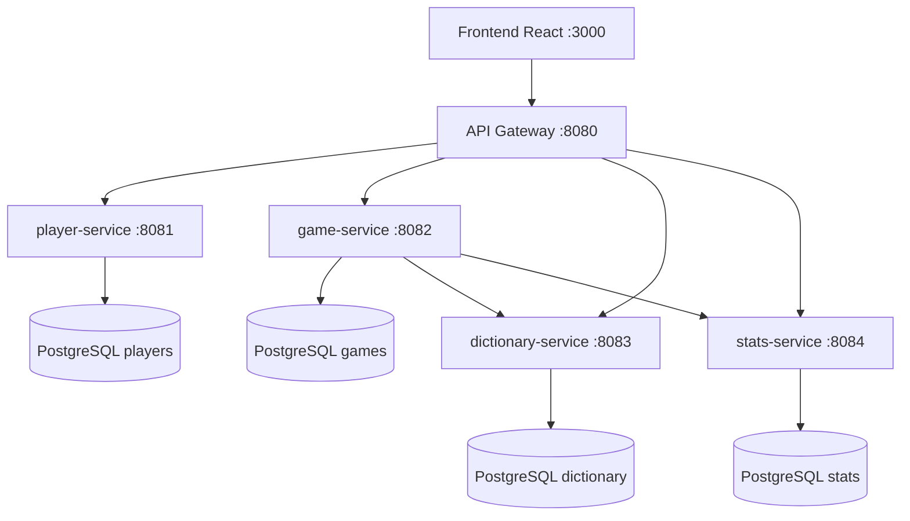

# Architecture — Motus Microservices

## Vue d'ensemble

## Découpage microservices

| Service | Bounded context | Base dédiée |
|---------|-----------------|-------------|
| **player-service** | Identité, inscription, authentification JWT | `motus_players` |
| **dictionary-service** | Mots valides, tirage aléatoire | `motus_dictionary` |
| **game-service** | Cycle de vie des parties, scoring Motus | `motus_games` |
| **stats-service** | Historique, classement, agrégats | `motus_stats` |
| **api-gateway** | Point d'entrée unique, CORS | — |

## Communication inter-services

- **game → dictionary** : `GET /words/random`, `GET /words/{word}/exists` (RestClient)
- **game → stats** : `POST /api/stats/results` à la fin de partie (best-effort)
- **Frontend → gateway** : toutes les API REST

## Sécurité

- JWT signé (secret partagé via variable d'environnement)
- Rôle `ADMIN` pour `/api/games/admin/search`
- Le mot mystère n'est renvoyé qu'après fin de partie (ou pour admin)

## Conteneurisation

- `docker-compose.yml` : 4 PostgreSQL + 5 services Java + frontend Nginx
- Images construites via `docker/Dockerfile.service` (build Maven multi-modules)

## Déploiement Kubernetes

- Namespace `motus`
- ConfigMap pour URLs inter-services et JWT
- Services NodePort pour l'API Gateway (port 30080)
