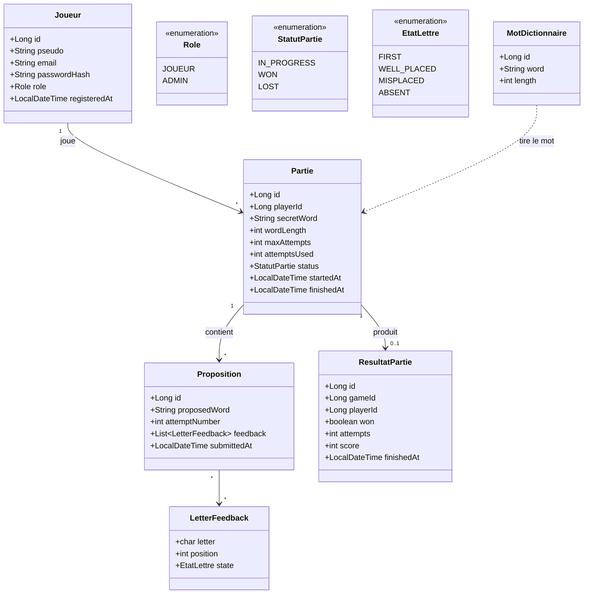

# Diagramme de classes métier

```mermaid
classDiagram
    class Joueur {
        +Long id
        +String pseudo
        +String email
        +String passwordHash
        +Role role
        +LocalDateTime registeredAt
    }

    class Role {
        <<enumeration>>
        JOUEUR
        ADMIN
    }

    class Partie {
        +Long id
        +Long playerId
        +String secretWord
        +int wordLength
        +int maxAttempts
        +int attemptsUsed
        +StatutPartie status
        +LocalDateTime startedAt
        +LocalDateTime finishedAt
    }

    class StatutPartie {
        <<enumeration>>
        IN_PROGRESS
        WON
        LOST
    }

    class Proposition {
        +Long id
        +String proposedWord
        +int attemptNumber
        +List~LetterFeedback~ feedback
        +LocalDateTime submittedAt
    }

    class LetterFeedback {
        +char letter
        +int position
        +EtatLettre state
    }

    class EtatLettre {
        <<enumeration>>
        FIRST
        WELL_PLACED
        MISPLACED
        ABSENT
    }

    class ResultatPartie {
        +Long id
        +Long gameId
        +Long playerId
        +boolean won
        +int attempts
        +int score
        +LocalDateTime finishedAt
    }

    class MotDictionnaire {
        +Long id
        +String word
        +int length
    }

    Joueur "1" --> "*" Partie : joue
    Partie "1" --> "*" Proposition : contient
    Proposition "*" --> "*" LetterFeedback
    Partie "1" --> "0..1" ResultatPartie : produit
    MotDictionnaire ..> Partie : tire le mot
```
